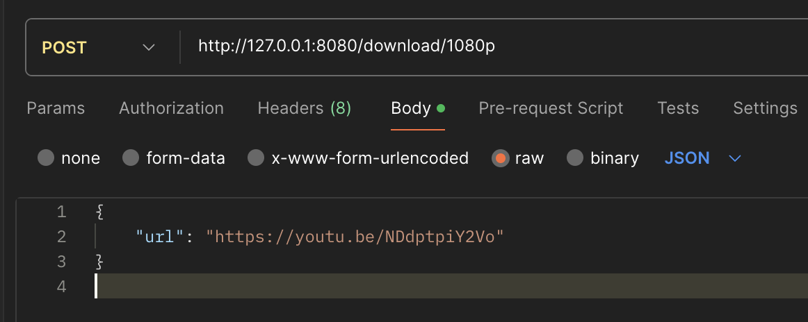

Youtube Download API

Foydalanish:

1. Loyihani klonlang:

```shell
git clone https://github.com/ozbekdev/youtube-download-api.git
```

2. Loyiha ichiga o'ting

```shell
cd youtube-download-api
```

3. Kerakli paketlarni o'rnating (sizda eng ohirigi lts nodejs va npm bo'lishi kerak)

```shell
npm install
```

4. Loyihani yurgizing

```shell
npm run start
```

<hr>
Diqqat qiling  `server.js` fayli ichida PORT'ni band emasligini tekshiring.
<hr>

API'dan foydalanish:
Youtubedan videoni yuklab olishda POST so'rovidan foydalaning.



So'rov url'si shunday bo'lishi kerak:

```text
http://127.0.0.1:8080/download/<resulution>
```

Resolutionlar bunday:

| No  | Resolution |
| --- | ---------- |
| 1   | 144p       |
| 2   | 240p       |
| 3   | 360p       |
| 4   | 720p       |
| 5   | 1080p      |
| 6   | 1440p      |
| 7   | 2160p      |

APIga so'rov yuborilishda YouTube url shunday yuboriladi (json):

```json
{
  "url": "https://youtube.com/<videourl>"
}
```

Agar video yuklansa shunday javob qaytadi:

```json
{
  "status": 200,
  "message": "Video downloaded successfully",
  "filename": "<videoning nomi>",
  "path": "<video saqlangan path>",
  "size": "video hajmi mb",
  "title": "videoning youtubedagi title",
  "quality": "rezolutions"
}
```
